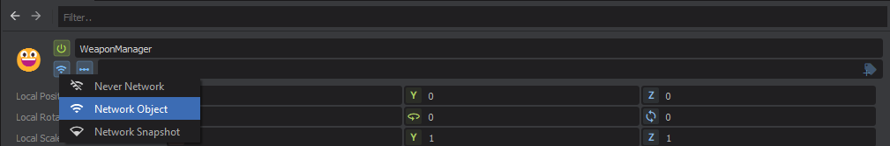

# Networking & Multiplayer

:::warning
The networking system in s&box is purposefully simple and easy. Our initial aim isn't to provide a bullet proof server-authoritative networking system. Our aim is to provide a system that is really easy to use and understand.

:::

# Overview

Here's a quick cheat sheet for the network system, to get you started.


### Create a new lobby

```csharp
Networking.CreateLobby( new LobbyConfig()
{
  MaxPlayers = 8,
  Privacy = LobbyPrivacy.Public,
  Name = "My Lobby Name"
} );
```

### List all available lobbies

```csharp
list = await Networking.QueryLobbies();
```

### Join an existing lobby

```csharp
Networking.Connect( lobbyId );
```


## Enable GameObject Networking

 

## Destroy Networked GameObject

```csharp
go.Destroy();
```


## Instantiating a Networked GameObject

```csharp
var go = PlayerPrefab.Clone( SpawnPoint.Transform.World );
go.NetworkSpawn();
```


## RPCs

```csharp
[Rpc.Broadcast]
public void OnJump()
{
	Log.Info( $"{this} Has Jumped!" );
}
```
