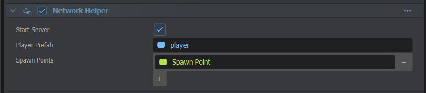

# Network Helper

To make a multiplayer game you need to take care of a few things. There's a special component that helps with those things, called NetworkHelper. This is a simple component that fits a lot of situations, but can be used as an example to code your own network component.


 


# Creating a server

If the `StartServer` property is enabled, a server will automatically be created when the scene is loaded. That is unless the network system is already active (because you're joining a server using this scene).


# Player Spawning

When a player enters a server you need to create an object for them to control. If it's a racing game, you'd spawn them a car to control. If it's a shooter game, you'd spawn them a player. 

Generally this is done using a prefab. You define your player gameobject and create a prefab, then you can drag the prefab object into the `PlayerPrefab` property on the component. 

You can also define a list spawnpoint GameObject's. The player will spawn randomly on one of them. If you don't define any spawn points, they will spawn at the location of the `NetworkHelper` object.


# Player Object

Your player object will usually contain a component with a function like this, which controls the GameObject if it isn't a `Proxy`.

```csharp
	protected override void OnUpdate()
	{
		// If we're a proxy then don't do any controls
		// because this client isn't controlling us!
		if ( IsProxy )
			return;

		// direction keys are pressed
		if ( !Input.AnalogMove.IsNearZeroLength )
		{
			WorldPosition += Input.AnalogMove.Normal * Time.Delta * 100.0f;	
		}

		// position the camera
		var camera = Scene.GetAllComponents<CameraComponent>().FirstOrDefault();
		camera.WorldRotation = new Angles( 45, 0, 0 );
		camera.WorldPosition  = WorldPosition  + camera.WorldRotation.Backward * 1500;
	}
```


# Under The Hood

`NetworkHelper` works by implementing `Component.INetworkListener`. This interface contains a method that is called when a connection becomes active on the server.

In this method we create an instance of the `PlayerPrefab` and set the new client as its owner. The client receives the information about this new object, and the fact that they're the owner, and takes over from there.
