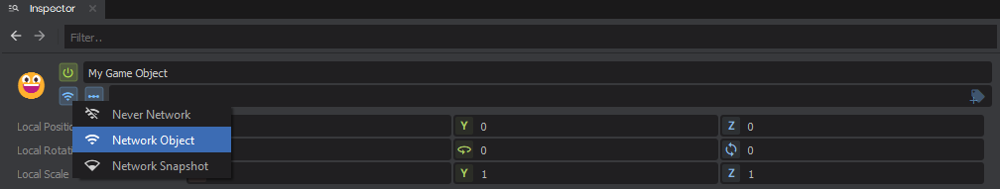
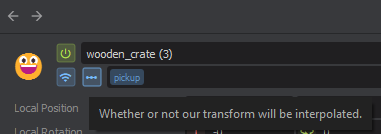

# Networked Objects

# Instantiating a Networked Object

Any game object can become a networked object by simply calling `NetworkSpawn()` on it. It will then be sent to all clients and can have [Sync Properties](/systems/networking-multiplayer/sync-properties.md) and [RPC Messages](/systems/networking-multiplayer/rpc-messages.md).


Every networked game object can have an [owner](/systems/networking-multiplayer/ownership.md), which determines who sends updates about its position, rotation and scale, as well as who can perform certain actions on it.

# Network Mode

All game objects can be one of three network modes. This mode determines whether other clients see it, or how they receive new information about it.

| Mode | Behaviour |
|------|-----------|
| `NetworkMode.Never` | This game object is never networked to others |
| `NetworkMode.Object` | The game object will be sent to other clients as its own networked object which can have synchronized properties and RPCs |
| `NetworkMode.Snapshot` *(default)* | The host will send this game object as part of the intitial scene snapshot when a client joins the game |


The network mode can also be changed for an object in the Scene from the Inspector view.

 

# Interpolation

By default the transform of all networked objects is interpolated smoothly for other clients.

## Disabling Interpolation

You can disable interpolation in one of two ways. Either by code, or using the inspector. 

 

```csharp
// Disable interpolation for this networked object.
Network.DisableInterpolation();
```


## Clearing Interpolation

Sometimes you want to clear any interpolation for an object. You can do that with `Network.ClearInterpolation()`. If you are the owner of the object, other clients will be told to clear interpolation when they next receive a transform update from us.


One use case for this would be to set the position of the object and have the position updated immediately for everybody without interpolation (teleporting.)

```csharp
Transform.Position = Vector3.Zero;
Network.ClearInterpolation();
```

# Refreshing a Networked Object


:::info
Once you call `NetworkSpawn()` on a game object, any further changes to its components or hierarchy will not be networked. Only information about the components or children that existed when you network spawned it will be sent to other clients.

:::


If you add new components, change the enabled state of a component, add new children or change the hierarchy of a networked object significantly, you can send a refresh update to other clients by calling `Network.Refresh()` on the networked game object or from one of its components.


By default, only the host can send refresh updates for networked objects. If you'd like to enable the owner to also send refresh updates you can do so by changing the [connection permissions](/systems/networking-multiplayer/connection-permissions.md) for a client.
