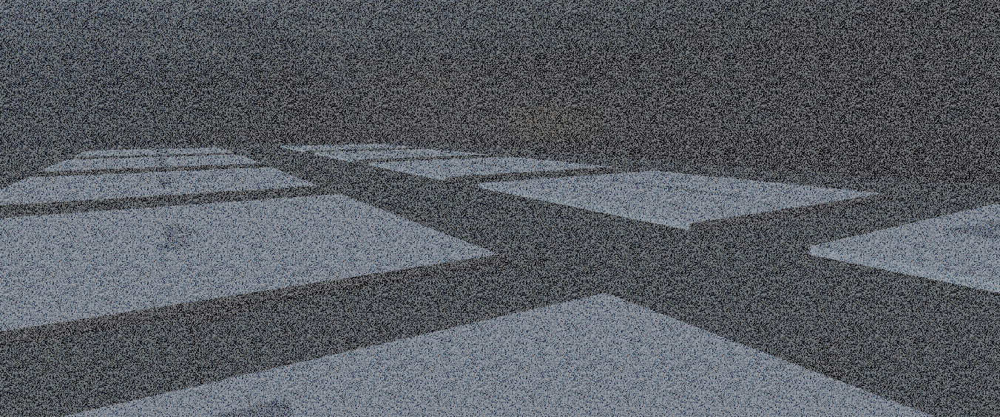

# FilmGrain



The **FilmGrain** component adds simulated film-style grain to the camera output. It's purely visual – it does not affect gameplay or lighting – and is intended to add texture, grit or stylistic noise to the final image.


| Property | Description |
|----------|-------------|
| **Intensity** | Overall visibility of the grain. 0 = off, 1 = heavy. |
| **Response** | How much the grain reacts to brightness. Higher values = less grain in darker areas. |

# Source

```csharp
namespace Sandbox;

/// <summary>
/// Applies a film grain effect to the camera
/// </summary>
[Title( "FilmGrain" )]
[Category( "Post Processing" )]
[Icon( "grain" )]
public sealed class FilmGrain : BasePostProcess<FilmGrain>
{
	[Range( 0, 1 )]
	[Property] public float Intensity { get; set; } = 0.1f;

	[Range( 0, 1 )]
	[Property] public float Response { get; set; } = 0.5f;

	public override void Render()
	{
		float intensity = GetWeighted( x => x.Intensity );
		if ( intensity.AlmostEqual( 0.0f ) ) return;

		float response = GetWeighted( x => x.Response, 1 );

		Attributes.Set( "intensity", intensity );
		Attributes.Set( "response", GetWeighted( x => x.Response, 1 ) );

		var shader = Material.FromShader( "shaders/postprocess/pp_filmgrain.shader" );
		var blit = BlitMode.WithBackbuffer( shader, Stage.AfterPostProcess, 200, false );
		Blit( blit, "FilmGrain" );
	}
}
```


```csharp
HEADER
{
    DevShader = true;
}

MODES
{
    Default();
    Forward();
}

COMMON
{
    #include "postprocess/shared.hlsl"
}

struct VertexInput
{
    float3 vPositionOs : POSITION < Semantic( PosXyz ); >;
    float2 vTexCoord : TEXCOORD0 < Semantic( LowPrecisionUv ); >;
};

struct PixelInput
{
    float2 uv : TEXCOORD0;

	// VS only
	#if ( PROGRAM == VFX_PROGRAM_VS )
		float4 vPositionPs		: SV_Position;
	#endif

	// PS only
	#if ( ( PROGRAM == VFX_PROGRAM_PS ) )
		float4 vPositionSs		: SV_Position;
	#endif
};

VS
{
    PixelInput MainVs( VertexInput i )
    {
        PixelInput o;
        
        o.vPositionPs = float4(i.vPositionOs.xy, 0.0f, 1.0f);
        o.uv = i.vTexCoord;
        return o;
    }
}

PS
{
    #include "postprocess/common.hlsl"
    #include "postprocess/functions.hlsl"
    #include "procedural.hlsl"

    #include "common/classes/Depth.hlsl"

    Texture2D g_tColorBuffer < Attribute( "ColorBuffer" ); SrgbRead( true ); >;

    float grainIntensity< Attribute("intensity"); >;
    float grainResponse< Attribute("response"); >;

    Texture2D g_tBlueNoise < Attribute( "BlueNoise" ); >;

    float3 FilmGrain( float3 vColor, float3 flSampledGrain, float intensity, float flResponse )
    {
        // Remap grain to a -1 -> 1 range
        flSampledGrain.rgb = flSampledGrain.b;

        // Grab our luminence and rescale based on response
        float lum = 1 - (GetLuminance( vColor.rgb ) * 5.0f);
        intensity *= saturate( lerp( 1.0f, saturate( lum ), flResponse ) );

        float3 fullGrain = saturate( (flSampledGrain - 0.1) * 2 ) - 0.7;

        vColor = lerp( vColor, GetLuminance( vColor.rgb ) * 0.1, intensity );

        return lerp( vColor, fullGrain, intensity );
    }

    float4 MainPs( PixelInput i ) : SV_Target0
    {
        float2 vScreenUv = CalculateViewportUv( i.vPositionSs.xy );
        float4 color = g_tColorBuffer.SampleLevel( g_sBilinearMirror, vScreenUv, 0 );

        float2 scale = float2( g_vRenderTargetSize.x , g_vRenderTargetSize.y ) / 128;
        
        float2 vGrainUvs = TileAndOffsetUv( vScreenUv, scale, float2(frac(g_flTime * 4.042f), frac(g_flTime * 34.054f)) );
        float3 flGrain = g_tBlueNoise.SampleLevel( g_sBilinearWrap, vGrainUvs, 0 ).rgb;
        flGrain += g_tBlueNoise.SampleLevel( g_sBilinearWrap, -vGrainUvs * 5, 0 ).brg;
        flGrain *= 0.5;

        color.rgb = FilmGrain( color.rgb, flGrain, grainIntensity, grainResponse );
        return color;
    }
}
```
