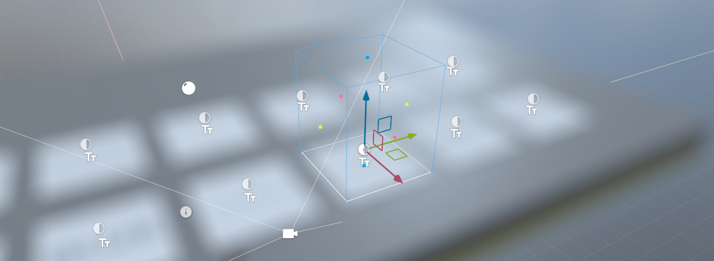

# PostProcessVolume

`PostProcessVolume` It is a component that applies a set of post-processing components when a camera is inside it.

The effect components can be on the same GameObject as the `PostProcessVolume` component, or on a child GameObject.

 

# Volume

The volume can be a box, sphere or infinite.

The **infinite mode** is useful for adding effects that you only want to apply sometimes. For example, you might want to fade up `FilmGrain` when a player is dying of radiation poisoning. You can have this effect in a GameObject with an infinite PostProcessVolume somewhere, and enable and slide up the `BlendWeight` depending on how much of the effect you want to apply.

# Blending

Blending is done according to how far in the volume you are using the `BlendDistance` property. 

# Editor Preview

When the volume is selected the editor will show a preview of that effect. If you don't want this to keep happening you can disable `Editor Preview` on the component.
