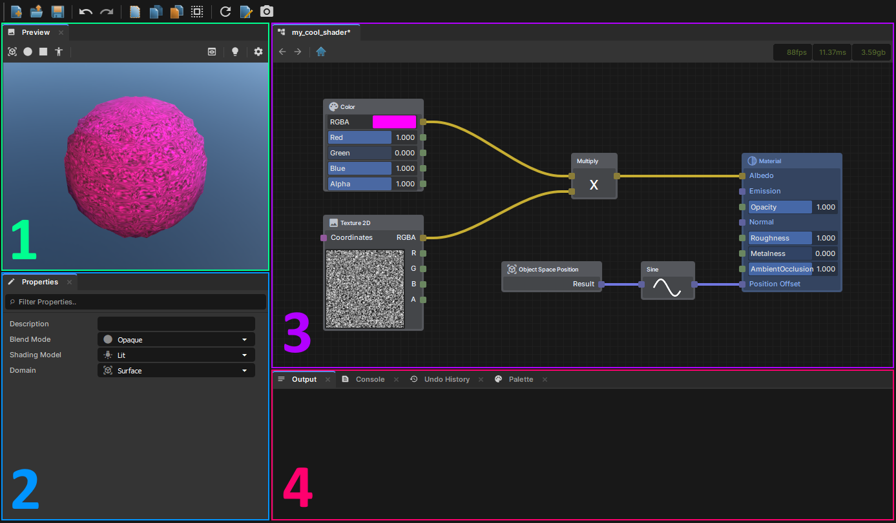
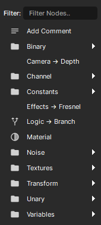
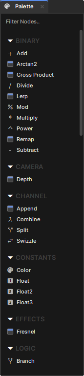
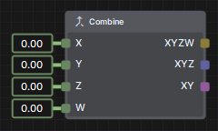
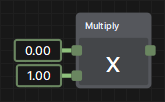
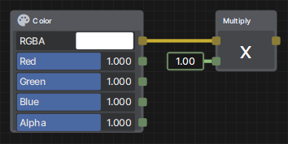
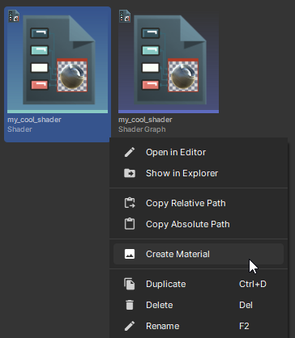

# Getting Started

Shader Graph is a visual scripting language that compiles to shader code. This is great for those who have never touched shader languages as well as those who have deep shader knowledge and want to quickly and easily prototype a shader idea they have.

# Shader Graph Editor

You can open the Editor by creating a new Shader Graph asset and double clicking on it. Upon opening it, you will be met with 4 main sections:

 

1. Preview - Where you can see your Shaders output update in real time. You can change the preview model/lighting to whatever you'd like.
2. Properties - An inspector window that allows you to edit the properties of the Shader or any selected nodes.
3. Graph - Where your nodes live. All graphs end with a "Material" node, which is where all your output values should eventually connect to.
4. Output - Will display any errors or warnings that may be present within your Shader Graph. You can also view the Console, Undo History, or Node Palette via the other tabs.

Each tab can be dragged around and re-positioned however you'd like, so feel free to customize it to your liking.

# Creating a Node

You can create any nodes that are available to you by simply right clicking anywhere in the Graph or by clicking and dragging nodes into the Graph from the Palette.

  

# Input/Output Types

Each node has a certain amount of inputs and outputs, each with their own types which are color-coordinated to determine if the value is a vector and how many components it has.

 

* Float (Green) - A single floating-point value
* Float2 (Purple) - A two-component vector (UV Coordinates, Screen Position)
* Float3 (Blue) - A three-component vector (Positions, Normals, RGB)
* Float4/Color (Yellow) - A four-component vector (RGBA, Positions with W)

Some nodes may output a different type given the input types, depending on how the node chooses to handle such a thing. 

  

Notice how the Multiply node returns a green Float value by default (given it's two Float inputs), but when a Color is input, the output becomes a yellow Float4/Color.

# Creating a Material

Once you have saved your Shader Graph, you'll see there is a compiled Shader file next to it, which can now be used as any other Shader when making a Material. You can also right click on it directly and select "Create Material" to instantly create a Material from it.

 
