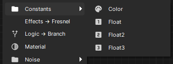
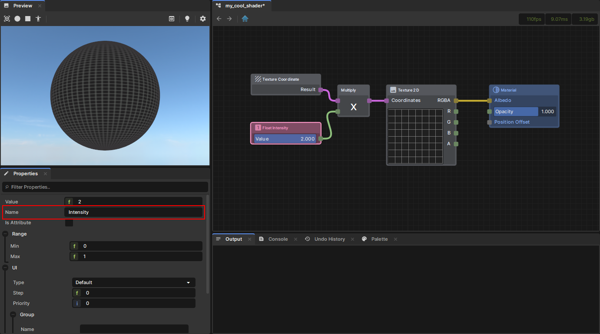
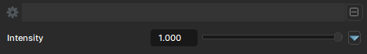

# Variables

Variables are useful for making your Graph easier to follow and understand, while also giving the option to expose certain values to the Material Editor and Code.

# Constants

Any Constant nodes created within a Shader will be compiled as constant values in shader code. These values cannot be changed

 

# Variables

Any Constant nodes that are given a name are automatically exposed in the Material Editor. these values can be customized when creating a Material from the Shader.

 

 

If a Constant has "Is Attribute" set to true, then the value will not be exposed in the Material Editor and will instead be accessible via `RenderAttributes` in code.
