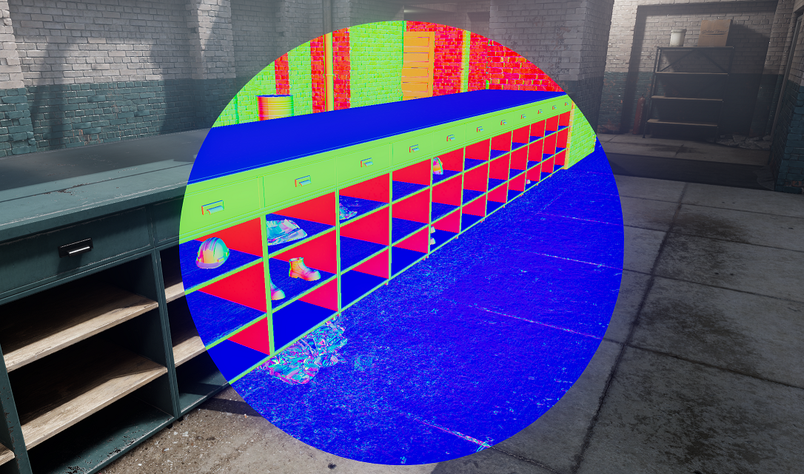

# G-Buffer

Materials that write to Depth PrePass also write to a G-Buffer, if you are using the standard ShadingModel, you just have to make sure you have a `Depth();` mode enabled

 

It contains minimal information about the object before we do the lighting pass, like it's Normals and Roughness, it can be used in post-processing to do all sorts of effects like accurate Ambient Occlusion and Screen-Space Reflections


You can sample the G-Buffer in any shader with

```cpp
float3 Normals::Sample( int2 ScreenPosition )
```

```cpp
float3 Roughness::Sample( int2 ScreenPosition )
```

If the object in that texel does not write to the G-buffer, then it reconstructs normal maps from it
