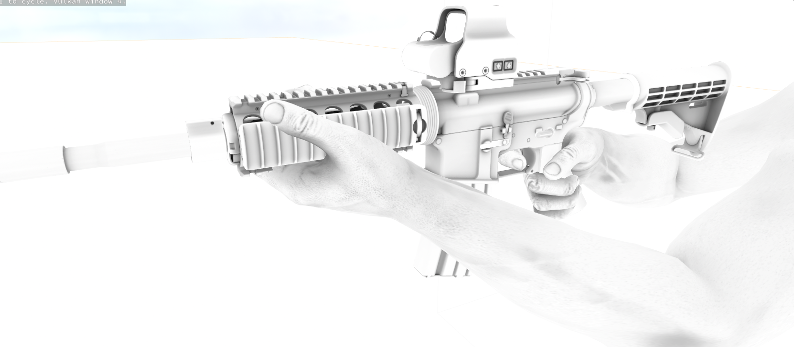
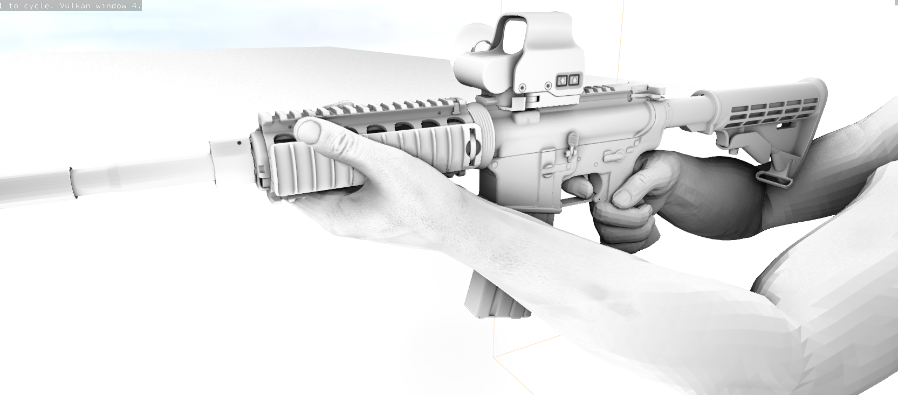

# SSAO

If your custom shader implements custom lighting you can sample the screen space ambient occlusion value for your lighting calculations.

```cpp
float ScreenSpaceAmbientOcclusion::Sample( float4 ScreenPosition )
```

  

## Custom Ambient Occlusion

You can implement your own ambient occlusion solution simply by providing the screen space ambient occlusion texture globally from your own component:

```csharp
commands.SetGlobal( "ScreenSpaceAmbientOcclusionTexture", AOTextureCurrent.ColorIndex );
```
