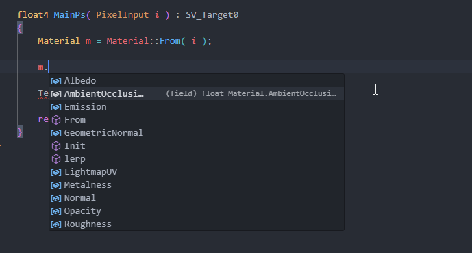

# Getting Started

You can create different types of shaders in s&box through code or the [ShaderGraph](/systems/shader-graph/index.md).

* Material Shaders: Rendering of objects in world space
* Post Processing Shaders: Full screen 
* Compute Shaders

Shaders are can be created from the Asset Browser, they are written in [HLSL](https://learn.microsoft.com/en-us/windows/win32/direct3dhlsl/dx-graphics-hlsl-language-syntax) in a VFX wrapper combining vertex and pixel stages together.

When you save a shader it is automatically recompiled and hotloaded showing you the results instantly.

### Code Editor

The recommended setup for editing shader code is [VSCode](https://code.visualstudio.com/) with the [Slang Extension](https://marketplace.visualstudio.com/items?itemName=shader-slang.slang-language-extension), this gives you a full IDE experience with intellisense which shows you what functions and properties you can use.

 

Opening your project folder in VSCode will prompt you to install the Slang extension, and automatically sets up file extension assosiations, workspace flavor and search paths.

If you're having trouble make sure your language mode is set to Slang and your workspace flavor is set to vfx.
