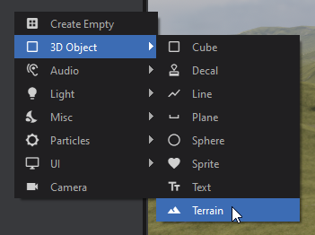
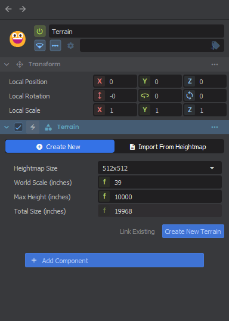

# Creating Terrain

To add Terrain to your Scene, right click in the Hierarchy and select 3D Object → Terrain from the menu.\nThe Terrain inspector will then prompt you to create, import or link an existing Terrain asset.\n

 

## Create New Terrain

Once you've created a Terrain GameObject it will be blank, you need to create the Terrain asset which stores all the height maps, control maps, materials, etc. It can then be reused across multiple scenes.

In the inspector window with the Terrain GameObject selected you will be asked how large you want your terrain to be. Pressing `Create New Terrain` will prompt you where to save your terrain asset.

| **Heightmap Size** | The size of your heightmap.Higher values increase VRAM usage drastically for combined heightmap and control maps:2048 x 2048 = 24MB4096 x 4096 = 96MB8192 x 8192 = 384MB |
|----------------|--------------------------------------------------------------------------------------------------------------------------------------------------------------------------|
| **World Scale** | How many inches per heightmap texel.A smaller scale gives more precision at the reduction of overall size. A larger scale gives more overall size at the reduction of precision.39 inches \~= 1 meter is a good default |
| **Max Height** | The maximum height your terrain will be in inches.The higher this is the less precision you get at lower values.                                                         |

 

## Link Existing Terrain

If you already have a terrain created in one scene that you want to reuse you can either drag the terrain asset in to automatically create the object, or press link existing and select an existing Terrain asset.
