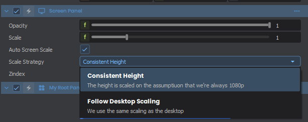

# UI

Our UI system is structured around Panels. A Panel is a c# class that can have parent and child panels.

The panels use a stylesheet and flex system for layout and rendering.

They can be created directly in code or via Razor files with HTML/CSS syntax.

# Making a C# Panel

Here's a basic example of a Panel that simply displays `Time.Now`:

```csharp
public class MyPanel : Panel
{
  public Label MyLabel { get; set; }
  
  public MyPanel()
  {
    MyLabel = new Label();
    MyLabel.Parent = this;
  }
  
  public override void Tick()
  {
    MyLabel.Text = $"{Time.Now}";
  }
}
```

# Using a Panel

Once you've create a Panel, it can be used in two different ways. The first is done identically to how we added a `Label` in the example above:

```csharp
var myPanel = new MyPanel();
myPanel.Parent = this;
```

The other is by using the following syntax within a [Razor Panels] file:

```markup
<MyPanel />
```

# Creating a C# Root Panel

To draw your UI to either the Screen or to a World Panel, you'll need to create a PanelComponent. A PanelComponent acts as the root of all UI, and is added to any GameObject with either a ScreenPanel or WorldPanel component. Here's an example of how you can create a basic one including the above panel:

```csharp
public sealed class MyRootPanel : PanelComponent
{
	MyPanel myPanel;
 
	protected override void OnTreeFirstBuilt()
	{
		base.OnTreeFirstBuilt();

		myPanel = new MyPanel();
		myPanel.Parent = Panel;
	}
}
```

# Scaling

By default, ScreenPanels will rescale all UI based on a 1080p target height automatically. If you wish to disable this, or change the scaling to target the Desktop Resolution, you can change the following:

 
