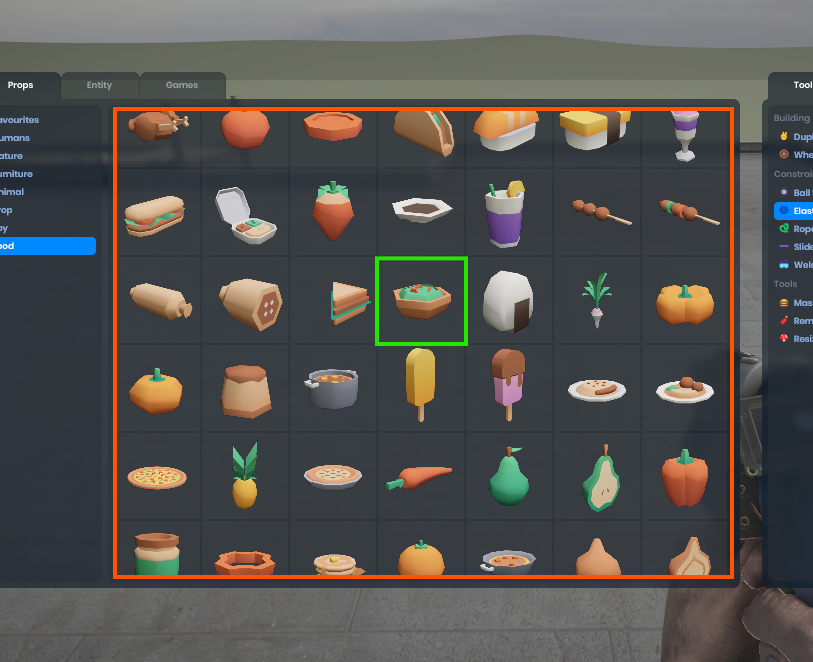

# VirtualGrid

`VirtualGrid` is a Panel that allows you to create a grid of items virtually. What this means is that if you have 1 million items, it won't render them and try to lay them all out at the same time. It'll just pick the few that are visible and create them. When you scroll down, it'll delete the ones it can no longer see and create the new visible ones.


 

# Razor

You can use it in Razor like this

```csharp
<VirtualGrid Items=@Items ItemSize=@(120)>
    <Item Context="item">
        @if (item is Package entry)
        {
            <SpawnButton Icon="@entry.Thumb" Action="@(() => Spawn(entry))"></SpawnButton>
        }
    </Item>
</VirtualGrid>
  
@code
{
    public Package[] Items{ get; set; }
}
```

Here you can see that it sets the Items property (which takes any `IEnumerable<T>`) and the `ItemSize`.

`Item` defines the cell contents. The cell has the class "cell" and will contain whatever you put in between the `<Item>` elements.

`ItemSize` is a `Vector2`. The cell size will be scaled up so it fits into the parent container flush. It'll keep the aspect ratio of the `ItemSize`.


## Gotchas

You need to make sure that `VirtualGrid` has a size in your styles. I usually make it width and height 100%.

All items obviously need to be the same size.

You can add spacing between elements using the gap styles on the `VirtualGrid` element.
